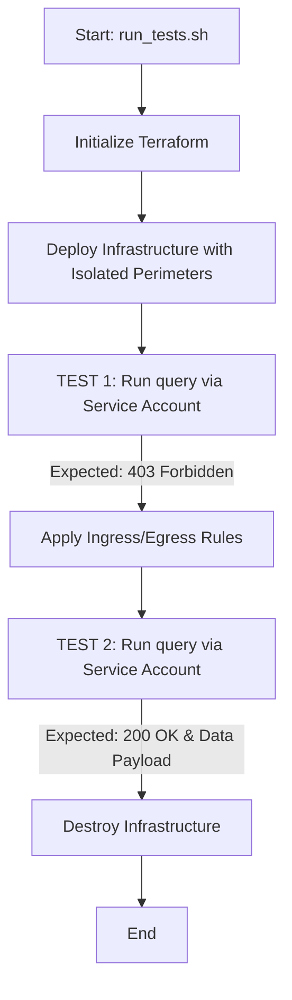

# Google Cloud VPC Service Controls & BigQuery Sharing Testing Suite

This repository contains a declarative Terraform configuration and testing harness designed to validate a **BigQuery Analytics Hub (DMZ Pattern) sharing mechanism across isolated VPC Service Controls (VPC-SC) perimeters**.

The setup demonstrates:
1. Restricting access to a dataset containing sensitive data using a VPC Service Controls perimeter.
2. Sharing data through an Analytics Hub Data Exchange and authorized views in a DMZ project.
3. Automatically block/allow querying across the perimeters depending on ingress and egress rules.

---

## 📁 Repository Structure

*   **`main.tf`**: The primary Terraform configuration containing all GCP resources (Projects, Folder, Datasets, Tables, Access Policies, Perimeters).
*   **`variables.tf`**: Declares variables for Organization ID, Billing ID, folder/policy overrides, and the toggle for cross-perimeter access.
*   **`outputs.tf`**: Exposes resource parameters (Project IDs, Service Account email) for the testing script.
*   **`install_env_tool.sh`**: Helper script to install `direnv` and set up automatic loading of environment variables.
*   **`run_tests.sh`**: The end-to-end test orchestration script.
*   **`.env`**: Local file containing organization and billing environment variables (ignored by git).
*   **`.envrc`**: Configuration file for `direnv` that maps local variables to Terraform-compatible variables.
*   **`.gitignore`**: Excludes state files, local credentials, and variables from version control.

---

## 🛠️ Prerequisites

Before running the suite, ensure you have the following installed and configured:

1.  **Google Cloud SDK (`gcloud`)**: Installed and authenticated with permissions to manage Organizations, Folders, Access Policies, and Projects.
    ```bash
    gcloud auth login
    gcloud auth application-default login
    ```
2.  **Homebrew**: Required to automatically install `direnv` on macOS.
3.  **Terraform (>= 1.3)**: Installed and accessible in your shell.

---

## 🚀 Setup & Execution

### 1. Configure Local Environment
Verify or update your `.env` file in the root of this directory with your GCP details:
```bash
export ORG_ID="YOUR_ORGANIZATION_ID"
export BILLING_ID="YOUR_BILLING_ACCOUNT_ID"
```

### 2. Install and Initialize `direnv`
Run the environment setup tool. This will install `direnv` via Homebrew and integrate it into your shell profile (e.g. `~/.zshrc`):
```bash
./install_env_tool.sh
```

**CRITICAL STEP**: After the script completes, restart your terminal or reload your shell profile to activate `direnv`:
```bash
source ~/.zshrc
```
*(When you enter this directory, you will see a message: `direnv: loading ~/workspace/vpc-sc-test/.envrc`. This means environment variables are automatically loaded and mapped to Terraform).*

### 3. Deploy and Run the Tests (Step-by-Step Flow)

The infrastructure deployment has been separated from the test execution script, allowing you to pause, view configurations in the Google Cloud Console, and manually verify perimeters before tearing them down.

#### Step A: Deploy the Isolated Infrastructure
Deploy the infrastructure with the service perimeters completely isolated:
```bash
./deploy.sh false
```
*(Wait ~3 minutes for IAM roles and VPC-SC perimeters to propagate).*

#### Step B: Run the Blocked Test (TEST 1)
Verify that querying the DMZ linked dataset across perimeters is blocked:
```bash
./run_tests.sh
```
*Expected outcome: `🔒 TEST BLOCKED: Request was blocked by VPC Service Controls` (403).*

#### Step C: Allow Cross-Perimeter Access
Update the perimeters to apply the ingress/egress rules:
```bash
./deploy.sh true
```
*(Wait ~2 minutes for VPC-SC rules to propagate).*

#### Step D: Run the Success Test (TEST 2)
Verify that the query now successfully passes across the perimeters:
```bash
./run_tests.sh
```
*Expected outcome: `✅ TEST PASSED: Cross-perimeter DMZ Linked Dataset queried successfully!` (200 OK).*

#### Step E: Inspect & Teardown
You can view and inspect the configured projects, datasets, and perimeters inside the GCP Console. Once you are finished, run the teardown script to destroy all resources cleanly:
```bash
./teardown.sh
```

---

## 🔍 How the Test Works

The test runner (`run_tests.sh`) automates the following lifecycle:



1.  **Infrastructure Provisioning (Isolated)**:
    *   Creates a new Folder and Scoped Access Policy.
    *   Creates Project A (Data Project) and Project B (DMZ).
    *   Enables APIs, creates datasets, views, Analytics Hub data exchanges, and service accounts.
    *   Provisions `perimeter_a` and `perimeter_b` in isolated states.
2.  **Test 1 (VPC-SC Blocks Access)**:
    *   Impersonates the test service account and attempts to query the shared DMZ linked dataset.
    *   **Result**: The request is blocked by VPC Service Controls, yielding a `403 Forbidden` response.
3.  **Policy Update (Ingress/Egress Enabled)**:
    *   Applies the Terraform configuration again with `enable_cross_perimeter_access=true` to enable ingress/egress policies between Project A and Project B.
4.  **Test 2 (Access Granted)**:
    *   Retries the query after VPC-SC policy propagation.
    *   **Result**: The query succeeds with a `200 OK` response, retrieving the text `"Top Secret Project A Data"`.
5.  **Teardown**:
    *   Runs `terraform destroy` to completely clean up folders, projects, perimeters, and IAM bindings.

---

## 🎨 Architecture & Alternative Design Patterns

For a comprehensive explanation of the IAM delegation model, VPC Service Controls boundaries, step-by-step query routing, and sequence diagrams, see the [Architecture Guide](vpc_sc_bq_sharing_architecture.md).

### Note on Querying Account VPC-SC Access
By default, real-time cross-perimeter queries require that the querying user or service account be allowed in the VPC-SC ingress/egress rules (to prevent unauthorized exfiltration via views). 

If you want to avoid adding end-user accounts to the VPC-SC rules, consider:
1. **Middle-Tier Proxy Pattern**: Route queries via an intermediary backend service (e.g. Cloud Run/Functions) running under a single service account that alone has cross-perimeter VPC-SC permissions.
2. **Asynchronous Data Replication Pattern**: Replicate the permitted data subset to the destination project asynchronously via a scheduled copy job. Users query the local copy entirely within their own perimeter.
3. **Unified/Single Service Perimeter Pattern**: Place the view project and source data project in the same VPC-SC perimeter, removing any internal perimeter boundaries. The client only needs ingress access into the single perimeter to execute queries.
