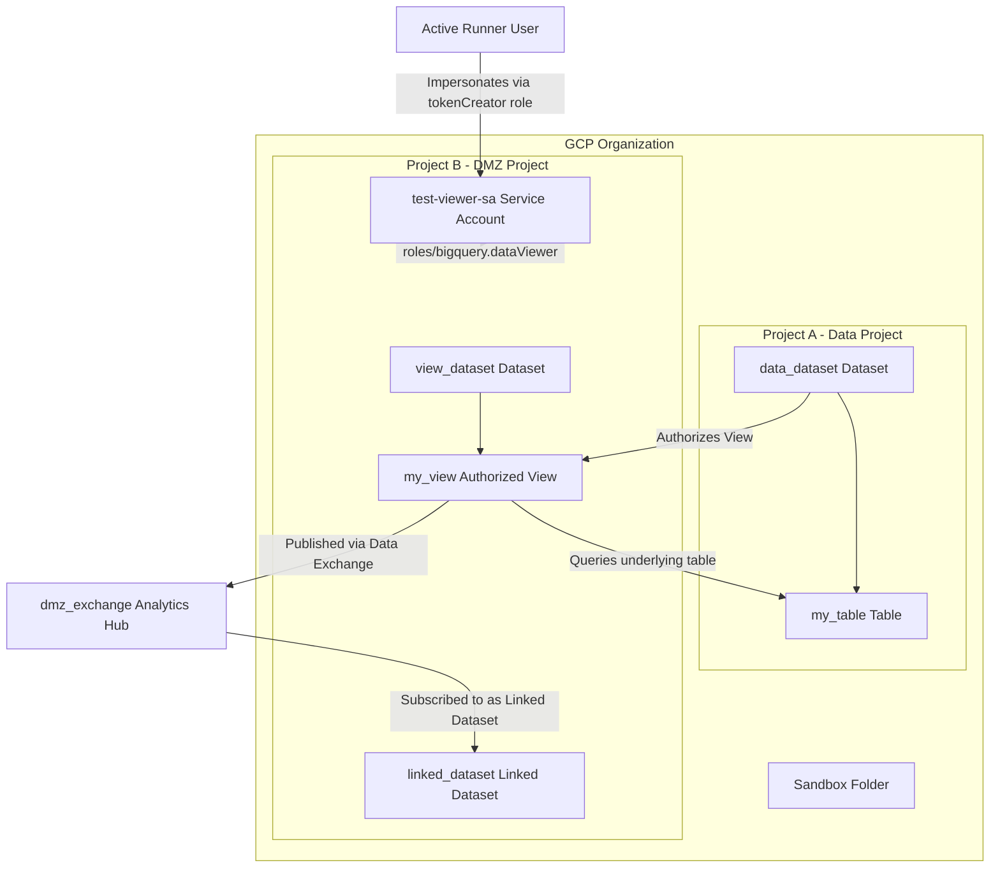
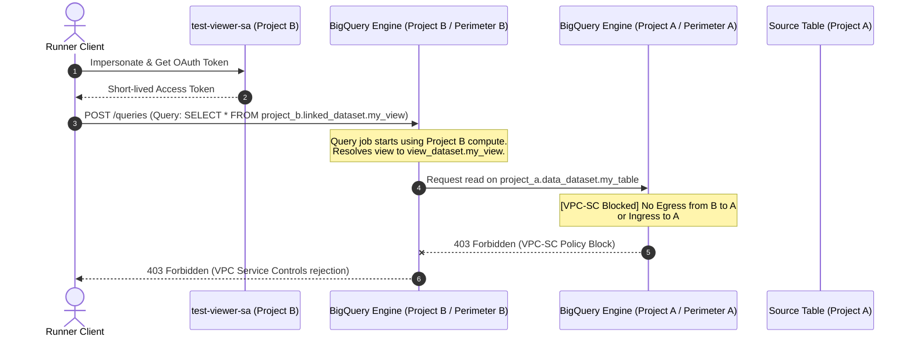
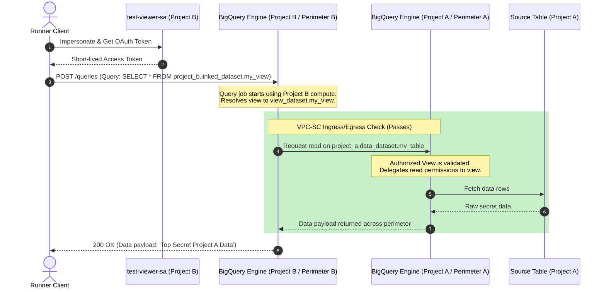
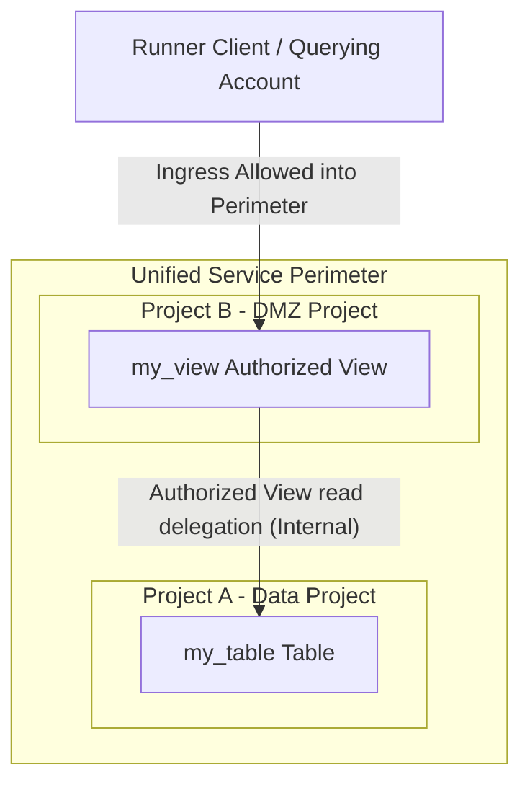
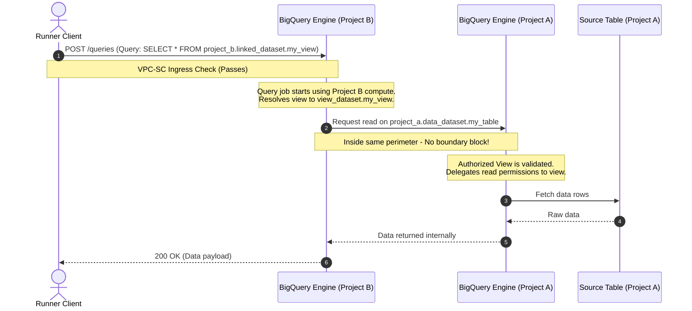

# Architecture Guide: Cross-Perimeter BigQuery Sharing via Analytics Hub

This document describes the architectural pattern, IAM permissions, VPC Service Controls (VPC-SC) perimeters, and data flows implemented in this codebase.

---

## 1. Architectural Overview

The goal of this architecture is to allow a **Third-Party Identity** inside a DMZ project (**Project B**) to query a **BigQuery View** that references a **source dataset** inside a restricted data project (**Project A**), without granting the third party direct access to the source data or exposing the source project to egress risks.

The architecture comprises two service perimeters isolating the two projects:

*   **Project A (Data Project)**: Houses the raw table (`data_dataset.my_table`). Isolated inside **Perimeter A**.
*   **Project B (DMZ/View Project)**: Houses the shared view (`view_dataset.my_view`) and a **Linked Dataset** subscribing to that view via **Analytics Hub**. Isolated inside **Perimeter B**.

---

## 2. Identity and IAM Permissions

Authentication and access delegation use the following configurations:

### Client / Runner Identity
*   **Identity**: `current_user` (e.g., `current_user` in variables, loaded dynamically).
*   **Permissions**:
    *   `roles/iam.serviceAccountTokenCreator` on the third-party service account (`test-viewer-sa`).
    *   This allows the runner to impersonate the service account and obtain short-lived OAuth access tokens to run queries as that identity.

### Third-Party Identity (`test-viewer-sa`)
*   **Identity**: `test-viewer-sa@project-b.iam.gserviceaccount.com` (created in Project B).
*   **Permissions in Project B**:
    *   `roles/bigquery.jobUser`: Grants compute permission to run BigQuery jobs (queries) using Project B's billing.
    *   `roles/bigquery.dataViewer`: Grants read access to the metadata and data of datasets inside Project B (specifically the linked dataset).
*   **Permissions in Project A**:
    *   **None**. The service account has zero direct IAM permissions on Project A resources.

### Dataset Authorization (IAM Delegation)
*   Because `test-viewer-sa` has no IAM permissions on Project A, querying the source table directly would fail.
*   To resolve this safely, we use an **Authorized View**:
    1.  The view `project_b.view_dataset.my_view` is defined in Project B.
    2.  `google_bigquery_dataset_access.authorized_view` authorizes this specific view to access Project A's `data_dataset`.
    3.  When a query is run against the view, BigQuery retrieves the data from Project A using the view creator/authorization permissions rather than checking the calling identity's direct permissions on Project A.

---

## 3. VPC Service Controls (VPC-SC)

VPC-SC creates a security boundary around GCP APIs. In this configuration, both `bigquery.googleapis.com` and `analyticshub.googleapis.com` are restricted.

### Perimeter Setup
*   **Perimeter A**: Restricts **Project A**.
*   **Perimeter B**: Restricts **Project B**.

### TEST 1: Perimeters Fully Isolated (`enable_cross_perimeter_access = false`)
When perimeters are isolated, any API call crossing from Project B's boundary to Project A's boundary is blocked:
*   The query job is submitted to Project B's BigQuery engine.
*   The BigQuery engine attempts to read the source data blocks from Project A.
*   Because no Ingress/Egress rules are configured to permit this, VPC-SC blocks the cross-perimeter request and returns a `403 Forbidden` error.

### TEST 2: Perimeters Connected (`enable_cross_perimeter_access = true`)
To enable secure querying, we define dynamic ingress/egress policies:

1.  **Perimeter B Egress Rule**:
    *   **From**: `ANY_IDENTITY` (inside Project B).
    *   **To**: `service_name = "*"` (covers `bigquery.googleapis.com`), `resources = ["projects/PROJECT_A_NUMBER"]` (strictly limited to Project A).
2.  **Perimeter A Ingress Rule**:
    *   **From**: `identity_type = "ANY_IDENTITY"`, `sources { resource = "projects/PROJECT_B_NUMBER" }` (strictly limited to requests originating from Project B).
    *   **To**: `operations { service_name = "*" }`, `resources = ["projects/PROJECT_A_NUMBER"]` (strictly limited to resources inside Project A).
3.  **Perimeter A Egress Rule**:
    *   **From**: `identity_type = "ANY_IDENTITY"`.
    *   **To**: `operations { service_name = "*" }`, `resources = ["projects/PROJECT_B_NUMBER"]` (to allow returning query responses/data back to Project B).

> [!IMPORTANT]
> **Why `ANY_IDENTITY` is required:**
> When querying a cross-perimeter view using service account token impersonation, BigQuery evaluates multiple identities:
> 1. The impersonated Service Account (`test-viewer-sa`).
> 2. The user delegate making the call (`current_user` who acquired the token).
> 3. The BigQuery Service Agent (`service-[PROJECT_NUMBER]@gcp-sa-bigquery.iam.gserviceaccount.com`).
> Specifying only the Service Account in the ingress/egress policies will cause VPC-SC to block the request due to a mismatch on the delegate or service agent identity. Using `ANY_IDENTITY` scoped strictly to target resources guarantees access while maintaining high security.

---

## 4. Architectural Flows and Diagrams

### Diagram 1: IAM & Resource Relationship Map

This diagram visualizes how IAM roles, service accounts, authorized views, and Analytics Hub are mapped out:

---

### Diagram 2: TEST 1 (Isolated Perimeters - Denied)

This diagram visualizes the data flow during **TEST 1** where the cross-perimeter query is blocked:

---

### Diagram 3: TEST 2 (Access Rules Configured - Approved)

This diagram visualizes the data flow during **TEST 2** where the ingress/egress rules are applied:

---

## 5. Alternative Design Patterns (Avoiding Direct VPC-SC Grants to Querying Accounts)

By default, direct real-time cross-perimeter queries require adding the querying identity (the caller) to the VPC-SC ingress/egress rules because VPC-SC inspects the original caller to prevent data exfiltration. If you want to avoid granting VPC-SC permissions directly to end-user querying accounts, consider the following alternative patterns:

### Pattern A: Middle-Tier Proxy (Identity Delegation)
Instead of having querying accounts call BigQuery directly, place an API gateway or backend service (e.g., Cloud Run, Cloud Functions) in front of the BigQuery resource:
1. **Dedicated Service Account**: Create a single "bridge" service account (e.g., `perimeter-bridge-sa`).
2. **VPC-SC Policy**: Grant VPC-SC ingress/egress permissions **only** to the `perimeter-bridge-sa`.
3. **Access Flow**: The querying client authenticates against the middle-tier API. The API validates the client's permissions, queries BigQuery using the `perimeter-bridge-sa` credentials, and returns the results.
* **Benefit**: The end-user querying accounts never cross the perimeter directly and do not need to be added to the VPC-SC policies.

### Pattern B: Asynchronous Data Replication
If real-time queries are not required, physically replicate the data instead of querying across the perimeter in real time:
1. **Replication Pipeline**: A scheduled pipeline (e.g., BigQuery Data Transfer Service or Cloud Dataflow) runs under a system service account that has cross-perimeter VPC-SC permissions.
2. **Local Copy**: The pipeline copies the permitted data subset from Project A to a dataset inside Project B.
3. **Access Flow**: Querying accounts in Project B query the local copy.
* **Benefit**: Since the queries are self-contained within Project B, they never cross the perimeter, and querying accounts require no VPC-SC access to Project A.

### Pattern C: Unified/Single Service Perimeter (Co-location)
If the view project and the source data project are placed inside the **same** VPC-SC perimeter:
1. **No Internal Boundaries**: Because both projects share a single security boundary, data access between the view project and the source project occurs entirely within the perimeter.
2. **Access Flow**: The querying client only needs to be granted VPC-SC ingress access into the single perimeter itself (to submit query jobs to the view project). No cross-perimeter rules are evaluated between the two projects.
* **Benefit**: No cross-perimeter ingress/egress rules need to be configured specifically between the view and source projects, and the querying account does not need to be added to any policies targeting the source project.

#### Pattern C: Resource Map

#### Pattern C: Data Flow Sequence

